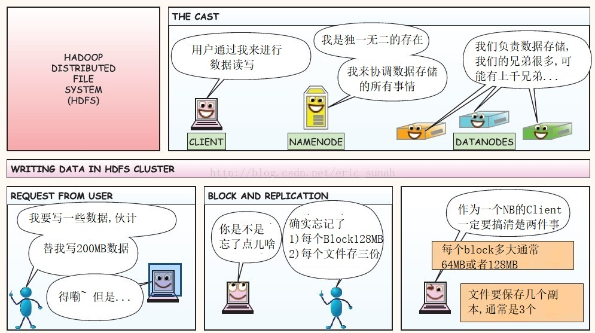
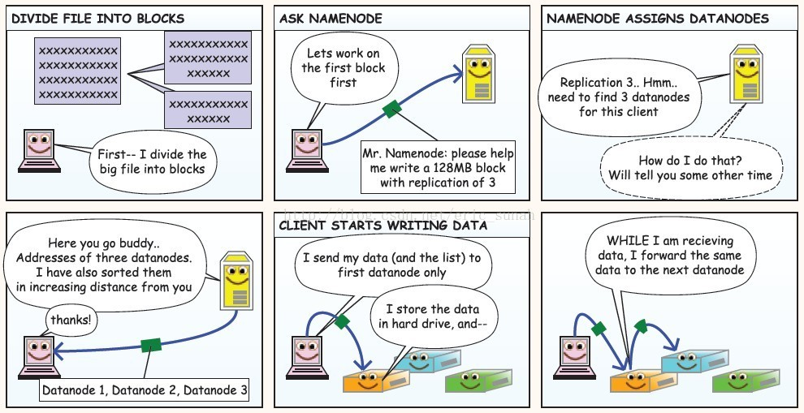
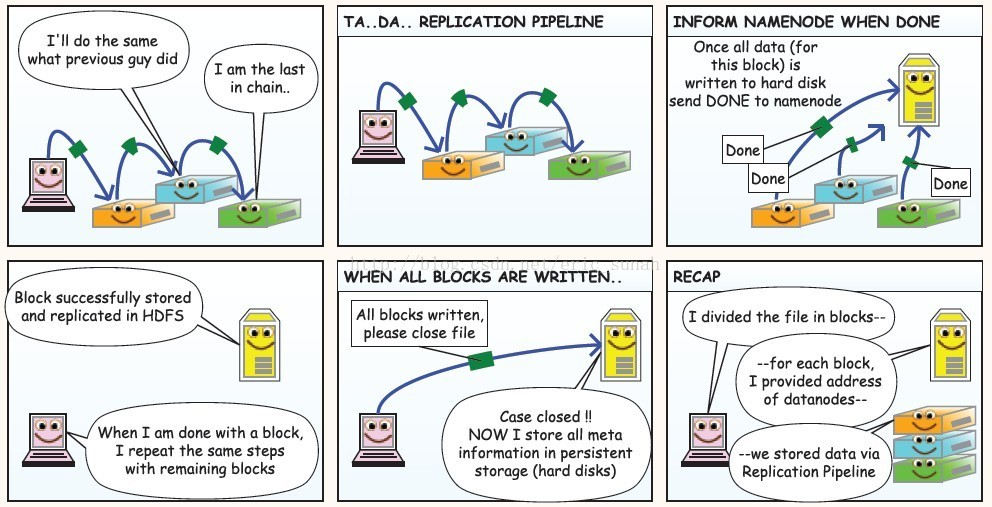
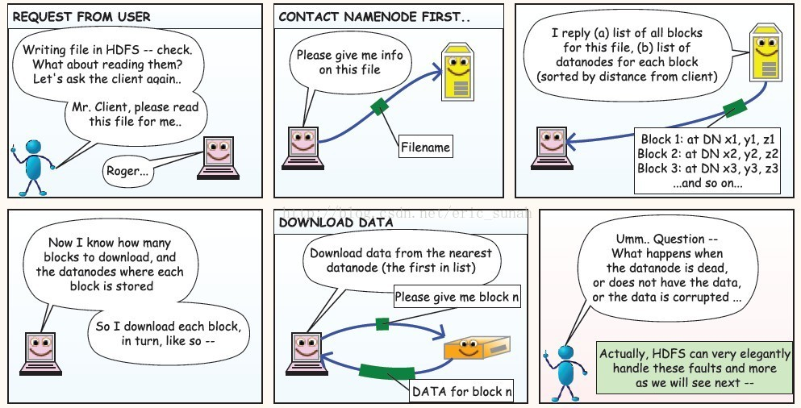

### 4.2 HDFS 读写流程& 高可用

- HDFS读写流程

  

  

  

  

  - 客户端向NameNode发出写文件请求。

  - 检查是否已存在文件、检查权限。若通过检查，直接先将操作写入EditLog，并返回输出流对象。 
    （注：WAL，write ahead log，先写Log，再写内存，因为EditLog记录的是最新的HDFS客户端执行所有的写操作。如果后续真实写操作失败了，由于在真实写操作之前，操作就被写入EditLog中了，故EditLog中仍会有记录，我们不用担心后续client读不到相应的数据块，因为在第5步中DataNode收到块后会有一返回确认信息，若没写成功，发送端没收到确认信息，会一直重试，直到成功）

  - client端按128MB的块切分文件。

  - client将NameNode返回的分配的可写的DataNode列表和Data数据一同发送给最近的第一个DataNode节点，此后client端和NameNode分配的多个DataNode构成pipeline管道，client端向输出流对象中写数据。client每向第一个DataNode写入一个packet，这个packet便会直接在pipeline里传给第二个、第三个…DataNode。 
    （注：并不是写好一个块或一整个文件后才向后分发）

  - 每个DataNode写完一个块后，会返回确认信息。 
    （注：并不是每写完一个packet后就返回确认信息，个人觉得因为packet中的每个chunk都携带校验信息，没必要每写一个就汇报一下，这样效率太慢。正确的做法是写完一个block块后，对校验信息进行汇总分析，就能得出是否有块写错的情况发生）

  - 写完数据，关闭输输出流。

  - 发送完成信号给NameNode。

    （注：发送完成信号的时机取决于集群是强一致性还是最终一致性，强一致性则需要所有DataNode写完后才向NameNode汇报。最终一致性则其中任意一个DataNode写完后就能单独向NameNode汇报，HDFS一般情况下都是强调强一致性） 

- HDFS如何实现高可用
  - 数据存储故障容错
    - 磁盘介质在存储过程中受环境或者老化影响,数据可能错乱
    - 对于存储在 DataNode 上的数据块，计算并存储校验和（CheckSum)
    - 读取数据的时候, 重新计算读取出来的数据校验和, 校验不正确抛出异常, 从其它DataNode上读取备份数据
  - 磁盘故障容错
    - DataNode 监测到本机的某块磁盘损坏
    - 将该块磁盘上存储的所有 BlockID 报告给 NameNode
    - NameNode 检查这些数据块在哪些DataNode上有备份,
    - 通知相应DataNode, 将数据复制到其他服务器上
  - DataNode故障容错
    - 通过心跳和NameNode保持通讯
    - 超时未发送心跳, NameNode会认为这个DataNode已经宕机
    - NameNode查找这个DataNode上有哪些数据块, 以及这些数据在其它DataNode服务器上的存储情况
    - 从其它DataNode服务器上复制数据
  - NameNode故障容错
    - 主从热备 secondary namenode

