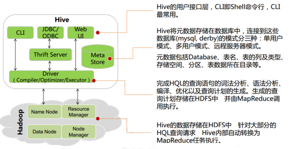

# Hive 

## 一、Hive概述

### 1 Hive简介 

```
学习目标
- 了解什么是Hive
- 了解为什么使用Hive
```

#### 1.1 什么是 Hive   

- Hive 由 Facebook 实现并开源，是基于 Hadoop 的一个数据仓库工具，可以将结构化的数据映射为一张数据库表，并提供 HQL(Hive SQL)查询功能，底层数据是存储在 HDFS 上。
- Hive 本质: 将 SQL 语句转换为 MapReduce 任务运行，使不熟悉 MapReduce 的用户很方便地利用 HQL 处理和计算 HDFS 上的结构化的数据,是一款基于 HDFS 的 MapReduce **计算框架**
- 主要用途：用来做离线数据分析，比直接用 MapReduce 开发效率更高。

#### 1.2 为什么使用 Hive

- 直接使用 Hadoop MapReduce 处理数据所面临的问题：
  - 人员学习成本太高
  - MapReduce 实现复杂查询逻辑开发难度太大

- 使用 Hive
  - 操作接口采用类 SQL 语法，提供快速开发的能力

  - 避免了去写 MapReduce，减少开发人员的学习成本
  - 功能扩展很方便

### 2 Hive 架构

#### 2.1 Hive 架构图



#### 2.2 Hive 组件

- 用户接口：包括 CLI、JDBC/ODBC、WebGUI。
  - CLI(command line interface)为 shell 命令行
  - JDBC/ODBC 是 Hive 的 JAVA 实现，与传统数据库JDBC 类似
  - WebGUI 是通过浏览器访问 Hive。
  - HiveServer2基于Thrift, 允许远程客户端使用多种编程语言如Java、Python向Hive提交请求
- 元数据存储：通常是存储在关系数据库如 mysql/derby 中。
  - Hive 将元数据存储在数据库中。
  - Hive 中的元数据包括
    - 表的名字
    - 表的列
    - 分区及其属性
    - 表的属性（是否为外部表等）
    - 表的数据所在目录等。
- 解释器、编译器、优化器、执行器:完成 HQL 查询语句从词法分析、语法分析、编译、优化以及查询计划的生成。生成的查询计划存储在 HDFS 中，并在随后有 MapReduce 调用执行

#### 2.3 Hive 与 Hadoop 的关系

Hive 利用 HDFS 存储数据，利用 MapReduce 查询分析数据。

### 3 Hive 与传统数据库对比

- hive 用于海量数据的离线数据分析。

<table>
  <tr>
    <th></th>
    <th>Hive</th>
    <th>关系型数据库</th>
  </tr>
  <tr>
    <td> ANSI SQL </td>
    <td> 不完全支持 </td>
    <td> 支持 </td>
  </tr>
  <tr>
    <td> 更新 </td>
    <td> INSERT OVERWRITE\INTO TABLE(默认) </td>
    <td> UPDATE\INSERT\DELETE </td>
  </tr>
  <tr>
    <td> 事务 </td>
    <td> 不支持(默认) </td>
    <td> 支持 </td>
  </tr>
  <tr>
    <td> 模式 </td>
    <td> 读模式 </td>
    <td> 写模式 </td>
  </tr>
  <tr>
    <td> 查询语言 </td>
    <td> HQL  </td>
    <td> SQL</td>
  </tr>
  <tr>
    <td> 数据存储 </td>
    <td> HDFS </td>
    <td> Raw Device or Local FS </td>
  </tr>
  <tr>
    <td> 执行 </td>
    <td> MapReduce </td>
    <td> Executor</td>
  </tr>
  <tr>
    <td> 执行延迟 </td>
    <td> 高 </td>
    <td> 低 </td>
  </tr>
  <tr>
    <td> 子查询 </td>
    <td> 只能用在From子句中 </td>
    <td> 完全支持 </td>
  </tr>
  <tr>
    <td> 处理数据规模 </td>
    <td> 大 </td>
    <td> 小 </td>
  </tr>
  <tr>
    <td> 可扩展性 </td>
    <td> 高 </td>
    <td> 低 </td>
  </tr>
  <tr>
    <td> 索引 </td>
    <td> 0.8版本后加入位图索引 </td>
    <td> 有复杂的索引 </td>
  </tr>
</table>

- hive支持的数据类型
  - 原子数据类型  
    - TINYINT SMALLINT INT BIGINT BOOLEAN FLOAT DOUBLE STRING BINARY TIMESTAMP DECIMAL CHAR VARCHAR DATE
  - 复杂数据类型
    - ARRAY
    - MAP
    - STRUCT
- hive中表的类型
  - 托管表 (managed table) (内部表)
  - 外部表

### 4 Hive 数据模型

- Hive 中所有的数据都存储在 HDFS 中，没有专门的数据存储格式
- 在创建表时指定数据中的分隔符，Hive 就可以映射成功，解析数据。
- Hive 中包含以下数据模型：
  - db：在 hdfs 中表现为 hive.metastore.warehouse.dir 目录下一个文件夹
  - table：在 hdfs 中表现所属 db 目录下一个文件夹
  - external table：数据存放位置可以在 HDFS 任意指定路径
  - partition：在 hdfs 中表现为 table 目录下的子目录
  - bucket：在 hdfs 中表现为同一个表目录下根据 hash 散列之后的多个文件